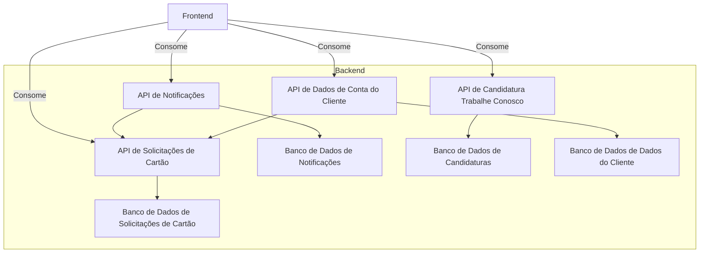

# Diagrama Relacional das APIs

# Teste

## Bootcamp Santander Java
# Grupos de Trabalho das APIs

## API de Notificações (Time da Fabi)

| Nome             | LinkedIn                              |
|------------------|---------------------------------------|
| Fabiana Marques Penteado   | [linkedin.com/in/fabiana-penteado-005a8241](linkedin.com/in/fabiana-penteado-005a8241)    |
| Everton Pontes Pereira | [linkedin.com/in/evertonpontes](https://www.linkedin.com/in/evertonpontes) |
| Guilherme Santos | [linkedin.com/in/aguilhermes-s](https://www.linkedin.com/in/aguilhermes-s/) |
|       |        |

## API de Solicitações de Cartão (Time do Ygor)

| Nome             | LinkedIn                              |
|------------------|---------------------------------------|
| Ygor      |       |
|       |         |
|     |      |
|      |      |

## API de Candidatura Trabalhe Conosco (Time do Magno)

| Nome             | LinkedIn                              |
|------------------|---------------------------------------|
| Magno Pereira    |      |
|    |     |
|    |    |
|     |      |

## API de Dados de Conta do Cliente (Time do Maicon)

| Nome             | LinkedIn                              |
|------------------|---------------------------------------|
| Maicon Rodrigues |   |
|    |      |
|     |       |
|   |   |

# Grupos de Trabalho - Frontend

## Grupo da Vanessa

| Nome             | LinkedIn                              |
|------------------|---------------------------------------|
| Vanessa Bueno  | [linkedin.com/in/vanessa-bueno](https://www.linkedin.com/in/vanessa-bueno/)   |
| Rhafaely Ananda Costa dos Reis     | [linkedin.com/in/rhafaelyreis](https://www.linkedin.com/in/rhafaelyreis/)      |
|    |    |
|     |     |

## Grupo da Sandrinha

| Nome             | LinkedIn                              |
|------------------|---------------------------------------|
| Sandrinha Silva  |   |
| Érica Lins    | [https://www.linkedin.com/in/rilins](linkedin.com/in/fabiana-penteado-005a8241)     |
|    |     |
|      |      |

